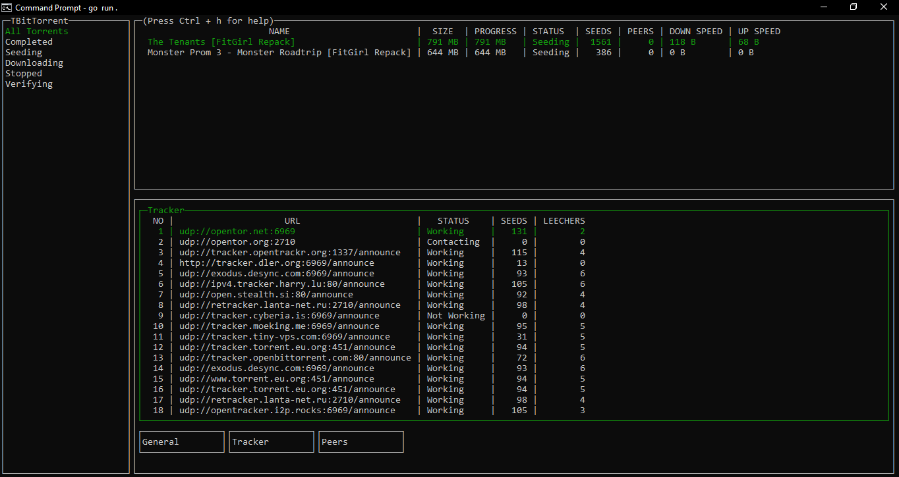
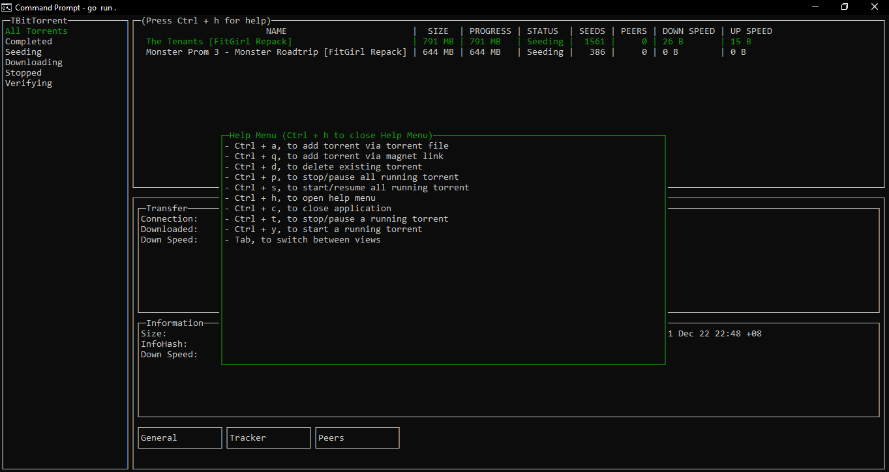

# TBitTorrent

BitTorrent Client for terminal in Go. Written with [Gocui](https://github.com/jroimartin/gocui) and [rain](https://github.com/cenkalti/rain) library for my Final Year Project :D, Inspired by qbittorrent.

## Screenshot

## Configuration

Most of the configurations are default from the rain torrent configurations, However you can change the configurations in the config.go file according to your liking. 

Note:
Thanks to [Gocui](https://github.com/jroimartin/gocui) and [rain](https://github.com/cenkalti/rain) for creating such amazing library so that i can create this :D. First time creating a Terminal ui app, its kinda messy so feel free to let me know what you guys think.

UPDATE: 
01-12-2022: Fixed character display error in printing tables. 
09-12-2022: Uploaded wrong folder in previous fix, reupload 
09-12-2022: fixed displaying long name cause table to disappear 
04-01-2023: fixed if torrent name not found will return name not found instead of blank 
15-06-2023: fixed import error on tui/helpers.go 
